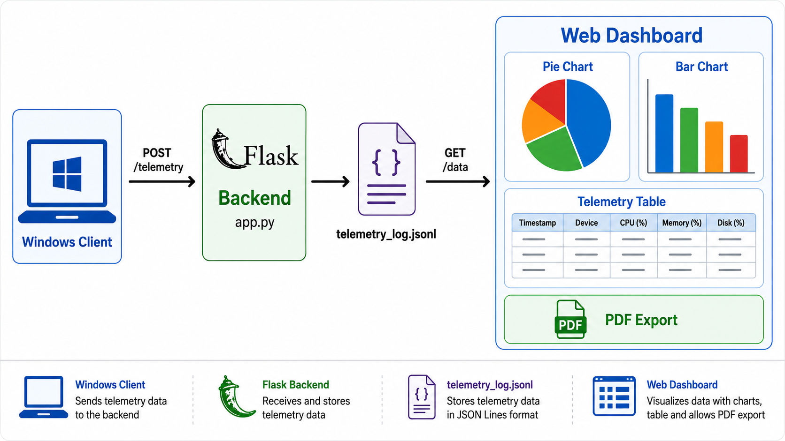

## Dashboard Preview

The dashboard provides a visual overview of Windows client telemetry, including operation safety distribution, operation counts, and detailed telemetry records.

The dashboard currently reports:
* **48 Safe operations**
* **10 Unsafe operations**
* **0 Invalid operations**

### Telemetry Dashboard


# Windows Client Telemetry & Safety Monitoring Dashboard

A Flask-based telemetry monitoring dashboard designed to receive, store, visualize, and export Windows client operation data.

The system provides a web-based interface for monitoring telemetry events, classifying operations as **Safe**, **Unsafe**, or **Invalid**, and presenting the results through interactive charts and a telemetry table.

## Features

<table>
<tr>
<td>

* Receive telemetry data through a REST API
* Store telemetry events in JSON Lines (`.jsonl`) format
* Display telemetry data in a web dashboard
* Automatic dashboard refresh every 5 seconds
* Export telemetry data to PDF
* Flask-based backend with REST endpoints
</td>
<td>

* Safe / Unsafe / Invalid operation classification
* Interactive pie chart for safety distribution
* Interactive bar chart for operation counts
* Timestamp formatting for telemetry records
* Responsive dashboard layout using Bootstrap

</td>
</tr>
</table>


## System Architecture




## Technology Stack

<table width="100%">
<tr>
<td colspan=3>
      Backend
</td>
<td colspan=5>
      Frontend
</td>
<td colspan=3>
      Data & Visualization
</td>
</tr>

<tr>
<td>
      


**Python**

</td>
<td>


**Flask**  

</td>
<td>


**REST API**

</td>

<td>
      


**HTML5**

</td>
<td>
      


**CSS3**

</td>
<td>
      


**JavaScript**

</td>
<td>
      


**Bootstrap 5**

</td>
<td>


      
**JSON / JSONL**

</td>
<td>


**Chart.js**

</td>
<td>

**Interactive Charts**

</td>
<td>

**Telemetry Analytics**
</td>
</tr>

<tr>
<td colspan=3>
      Reporting & Export
</td>

<td colspan=5>
      Application
</td>

<td colspan=3>
      Development Tools
</td>

</tr>

<tr>
<td>

**html2pdf.js**

</td>
<td>

**PDF Generation**

</td>
<td>

**Telemetry Reports**
</td>
<td colspan=2>

**Windows Telemetry**

</td>
<td>

**REST Endpoints**

</td>
<td>

**JSONL Storage**

</td>
<td>

**PDF Export**

</td>
<td>


**Git**

</td>
<td>


**GitHub**

</td>
<td>


**VSCode**
</td>

</tr>
</table>


## Project Structure

```text
Telemetry-Dashboard/
│
├── app.py
├── index.html
├── requirements.txt
├── LICENSE
├── README.md
├── .gitignore
│
└── static/
    ├── css/
    │   └── styles.css
    │
    └── js/
        └── scripts.js
```

The telemetry log file is intentionally excluded from version control because it may contain sensitive telemetry information.

## Installation

<table>
<tr>
<td colspan=3>

### 1. Clone the repository

```bash
git clone https://github.com/JayarthaSengupta/Telemetry-Dashboard.git
cd Telemetry-Dashboard
```


</td>
</tr>
<tr>
<td>

### 2. Create a virtual environment

Windows:

```powershell
python -m venv venv
```

Activate it:

```powershell
venv\Scripts\activate
```

</td>
<td>

### 3. Install dependencies

```powershell
pip install -r requirements.txt
```

</td>
<td>
      
### 4. Run the application

```powershell
python app.py
```

The server runs on:

```text
http://localhost:8080
```

Open that address in a browser to access the dashboard.

</td>
</tr>
</table>

---

## API Endpoints

<table>
<tr>
<td colspan=2>

### `GET /`

Returns the telemetry dashboard.

</td>
</tr>
<tr>
<td>

### `POST /telemetry`

Receives telemetry data from a client and stores it in the telemetry log.

Example request:

```json
{
    "timestamp": "2026-08-21T12:30:00",
    "ip": "192.168.1.10",
    "user": "example_user",
    "operation_type": "File Access",
    "safe": true
}
```

</td>
<td>

### `GET /data`

Returns the stored telemetry records as JSON.

Example response:

```json
[
    {
        "timestamp": "2026-08-21T12:30:00",
        "ip": "192.168.1.10",
        "user": "example_user",
        "operation_type": "File Access",
        "safe": true
    }
]
```

</td>
</tr>
</table>

---
<table>
<tr>
<td>

**Safety Classification**

</td>
<td>

**Dashboard**

</td>
</tr>
<tr>
<td>
      
Each telemetry operation is categorized into one of three states:

<table>
<tr>
<td>

Status 

</td>
<td>

Description

</td>
</tr>
<tr>
<td>

✅ Safe

❌ Unsafe

⚠️ Invalid

</td>
<td>

Operation is marked as safe

Operation is marked as unsafe

Safety value is missing or invalid

</td>
</tr>
</table>

The dashboard calculates the total number of operations in each category and visualizes the distribution using Chart.js.

</td>
<td>

The dashboard provides:

<table>
<tr>
<td>

* Operation Safety Distribution
* Operation Safety Count
* Total Safe operations

</td>
<td>

* Total Unsafe operations
* Invalid telemetry records
* Detailed telemetry table
* PDF report generation

</td>
</tr>
</table>

</td>
</tr>
</table>

## Data Storage

Telemetry events are stored as JSON Lines.

Each telemetry event occupies one line in:

```text
telemetry_log.jsonl
```

The file is excluded from Git using `.gitignore` to prevent telemetry records from being accidentally committed to the repository.

---

## Security Considerations

This project is intended as a demonstration and development project.

Before using it in a production environment, additional security controls should be implemented, including, but not limited to:

<table>
<tr>
<td>

- Authentication & Authorization
- HTTPS
- Input Validation

</td>
<td>

- Rate Limiting
- Secure Telemetry Transmission
- Database-backed Storage

</td>
<td>

- Access Control
- Log Rotation
- PII Protection
- Production WSGI Deployment

</td>
</tr>
</table>

---

## Future Improvements

Potential extensions include:


<table>
<tr>
<td>

* Real-time WebSocket telemetry
* PostgreSQL or MySQL storage
* User authentication
* Advanced filtering and search

</td>
<td>

* Pagination for large telemetry datasets
* Date-range analytics
* Threat detection
* Anomaly detection

</td>
<td>

* Windows client integration
* Docker deployment
* Role-based access control
* Production monitoring and logging

</td>
</tr>
</table>

---

## License

This project is licensed under the MIT License. See the `LICENSE` file for details.

---

## Author

**Jayartha Sengupta**

GitHub: [JayarthaSengupta](https://github.com/JayarthaSengupta)
