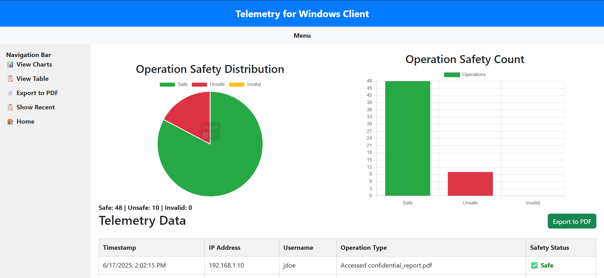

## Dashboard Preview

The dashboard provides a visual overview of Windows client telemetry, including operation safety distribution, operation counts, and detailed telemetry records.

The dashboard currently reports:
* **48 Safe operations**
* **10 Unsafe operations**
* **0 Invalid operations**

### Telemetry Dashboard



# Windows Client Telemetry & Safety Monitoring Dashboard

A Flask-based telemetry monitoring dashboard designed to receive, store, visualize, and export Windows client operation data.

The system provides a web-based interface for monitoring telemetry events, classifying operations as **Safe**, **Unsafe**, or **Invalid**, and presenting the results through interactive charts and a telemetry table.

## Features

* Receive telemetry data through a REST API
* Store telemetry events in JSON Lines (`.jsonl`) format
* Display telemetry data in a web dashboard
* Automatic dashboard refresh every 5 seconds
* Safe / Unsafe / Invalid operation classification
* Interactive pie chart for safety distribution
* Interactive bar chart for operation counts
* Timestamp formatting for telemetry records
* Export telemetry data to PDF
* Responsive dashboard layout using Bootstrap
* Flask-based backend with REST endpoints

## System Architecture

```text
Windows Client
      │
      │ POST /telemetry
      ▼
┌───────────────────┐
│   Flask Backend   │
│      app.py       │
└─────────┬─────────┘
          │
          ▼
 telemetry_log.jsonl
          │
          │ GET /data
          ▼
┌──────────────────────────┐
│    Web Dashboard         │
│                          │
│  ┌────────┐ ┌─────────┐  │
│  │  Pie   │ │   Bar   │  │
│  │ Chart  │ │  Chart  │  │
│  └────────┘ └─────────┘  │
│                          │
│      Telemetry Table     │
│                          │
│       PDF Export         │
└──────────────────────────┘
```

## Technology Stack

### Backend

* Python
* Flask
* JSON / JSONL

### Frontend

* HTML5
* CSS3
* JavaScript
* Bootstrap 5
* Chart.js
* html2pdf.js

### Development Tools

* Git
* GitHub
* Visual Studio Code

## Project Structure

```text
Telemetry-Dashboard/
│
├── app.py
├── index.html
├── requirements.txt
├── LICENSE
├── README.md
├── .gitignore
│
└── static/
    ├── css/
    │   └── styles.css
    │
    └── js/
        └── scripts.js
```

The telemetry log file is intentionally excluded from version control because it may contain sensitive telemetry information.

## Installation

### 1. Clone the repository

```bash
git clone https://github.com/JayarthaSengupta/Telemetry-Dashboard.git
cd Telemetry-Dashboard
```

### 2. Create a virtual environment

Windows:

```powershell
python -m venv venv
```

Activate it:

```powershell
venv\Scripts\activate
```

### 3. Install dependencies

```powershell
pip install -r requirements.txt
```

### 4. Run the application

```powershell
python app.py
```

The server runs on:

```text
http://localhost:8080
```

Open that address in a browser to access the dashboard.

## API Endpoints

### `GET /`

Returns the telemetry dashboard.

### `POST /telemetry`

Receives telemetry data from a client and stores it in the telemetry log.

Example request:

```json
{
    "timestamp": "2026-08-21T12:30:00",
    "ip": "192.168.1.10",
    "user": "example_user",
    "operation_type": "File Access",
    "safe": true
}
```

### `GET /data`

Returns the stored telemetry records as JSON.

Example response:

```json
[
    {
        "timestamp": "2026-08-21T12:30:00",
        "ip": "192.168.1.10",
        "user": "example_user",
        "operation_type": "File Access",
        "safe": true
    }
]
```

## Safety Classification

Each telemetry operation is categorized into one of three states:

| Status     | Description                        |
| ---------- | ---------------------------------- |
| ✅ Safe     | Operation is marked as safe        |
| ❌ Unsafe   | Operation is marked as unsafe      |
| ⚠️ Invalid | Safety value is missing or invalid |

The dashboard calculates the total number of operations in each category and visualizes the distribution using Chart.js.

## Dashboard

The dashboard provides:

* Operation Safety Distribution
* Operation Safety Count
* Total Safe operations
* Total Unsafe operations
* Invalid telemetry records
* Detailed telemetry table
* PDF report generation

## Data Storage

Telemetry events are stored as JSON Lines.

Each telemetry event occupies one line in:

```text
telemetry_log.jsonl
```

The file is excluded from Git using `.gitignore` to prevent telemetry records from being accidentally committed to the repository.

## Security Considerations

This project is intended as a demonstration and development project.

Before using it in a production environment, additional security controls should be implemented, including:

* Authentication and authorization
* HTTPS
* Input validation
* Rate limiting
* Secure telemetry transmission
* Database-backed storage
* Access control
* Log rotation
* Protection of personally identifiable information
* Production WSGI deployment instead of Flask's development server

## Future Improvements

Potential extensions include:

* Real-time WebSocket telemetry
* PostgreSQL or MySQL storage
* User authentication
* Advanced filtering and search
* Pagination for large telemetry datasets
* Date-range analytics
* Threat detection
* Anomaly detection
* Windows client integration
* Docker deployment
* Role-based access control
* Production monitoring and logging

## License

This project is licensed under the MIT License. See the `LICENSE` file for details.

## Author

**Jayartha Sengupta**

<<<<<<< HEAD
GitHub: [JayarthaSengupta](https://github.com/JayarthaSengupta)
=======
GitHub: [JayarthaSengupta](https://github.com/JayarthaSengupta)
>>>>>>> db82bd5e42ff6d631e416aece8bf0342774de9b8
